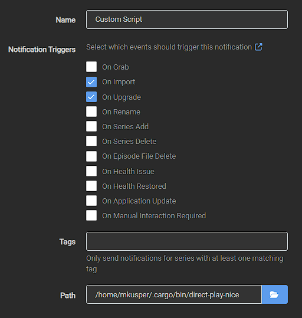

# direct-play-nice

A CLI utility to convert video files to Direct-Play-compatible (the single best optimization for your home video streaming server) formats for your video streaming server.

## Purpose

This tool was created to convert video files to formats that satisfy Direct Play requirements (eg. Chromcast) for all users of your video streaming server. It's intended to be paired with [Sonarr](https://wiki.servarr.com/sonarr/custom-scripts), [Radarr](https://wiki.servarr.com/radarr/custom-scripts), etc as a Custom Script. It is intended to be added to a video streaming service as an optimization feature and seamless to the end user (ie. Direct Play selected by default).

## Features

- Converts any video file supported by [FFmpeg](https://www.ffmpeg.org/)
- Satisfies Direct Play requirements for [Plex](https://www.plex.tv/), [Jellyfin](https://jellyfin.org/), etc.
- Can be used standalone or as a Custom Script Connection with [Sonarr](https://wiki.servarr.com/sonarr/custom-scripts), [Radarr](https://wiki.servarr.com/radarr/custom-scripts), etc.
- Allows for achieving [Direct Play](https://support.plex.tv/articles/200250387-streaming-media-direct-play-and-direct-stream/) with all videos in a way seamless to the end user.

### Supported Streaming Devices

|Device Name                   |Release Year|Video Codecs                                      |Audio Codecs                                                                                 |Resolution Support|
|------------------------------|------------|--------------------------------------------------|---------------------------------------------------------------------------------------------|------------------|
|Chromecast                    |2013        |H.264, VP8                                        |HE-AAC, LC-AAC, MP3, Vorbis, WAV (LPCM)                                                      |Up to 1080p       |
|Chromecast 2                  |2015        |H.264, VP8                                        |HE-AAC, LC-AAC, MP3, Vorbis, WAV (LPCM)                                                      |Up to 1080p       |
|Chromecast Audio              |2015        |N/A                                               |HE-AAC, LC-AAC, MP3, Vorbis, WAV (LPCM), FLAC                                                |N/A               |
|Chromecast Ultra              |2016        |H.264, VP8, VP9, HEVC                             |HE-AAC, LC-AAC, MP3, Vorbis, WAV (LPCM), FLAC                                                |Up to 4K          |
|Chromecast 3                  |2018        |H.264, VP8, VP9                                   |HE-AAC, LC-AAC, MP3, Vorbis, WAV (LPCM)                                                      |Up to 1080p       |
|Chromecast with Google TV     |2020        |H.264, VP8, VP9, HEVC, Dolby Vision, HDR10, HDR10+|HE-AAC, LC-AAC, MP3, Vorbis, WAV (LPCM), FLAC, Dolby Digital, Dolby Digital Plus, Dolby Atmos|Up to 4K HDR      |
|Chromecast with Google TV (HD)|2022        |H.264, VP8, VP9, HEVC, HDR10, HDR10+              |HE-AAC, LC-AAC, MP3, Vorbis, WAV (LPCM), FLAC, Dolby Digital, Dolby Digital Plus, Dolby Atmos|Up to 1080p HDR   |


## Usage

This program can be run standlone directly on the CLI or as a Custom Script Connection with [Sonarr](https://wiki.servarr.com/sonarr/custom-scripts) or [Radarr](https://wiki.servarr.com/radarr/custom-scripts).

### CLI

``` bash
Usage: direct_play_nice.exe [OPTIONS] <INPUT_FILE> <OUTPUT_FILE>

Arguments:
  <INPUT_FILE>   Video file to convert
  <OUTPUT_FILE>  Our output direct-play-compatible video file

Options:
  -s, --streaming-devices <STREAMING_DEVICES>  List of StreamingDevice
  -c, --config-file <CONFIG_FILE>              Path to the configuration file
      --hw-accel <HW_ACCEL>                    Hardware acceleration: auto|none|nvenc|vaapi|qsv|videotoolbox|amf (default: auto)
      --probe-hw                               Print available HW devices/encoders and exit
      --probe-codecs                           Print all FFmpeg encoders/decoders and exit
      --only-video                             Probe filter: only show video codecs
      --only-hw                                Probe filter: only show hardware-capable codecs
      --probe-json                             Output probe results as JSON
  -h, --help                                   Print help
  -V, --version                                Print version
```

### Sonarr / Radarr

When running via Sonarr, Radarr, etc you can use this program to convert each downloaded video file to a Direct-Play-compatible format by adding it as a Custom Script Connection ( `Settings >> Connection >> Custom Script` )



## Building

This project relies on [FFmpeg](https://www.ffmpeg.org/) and [rsmpeg](https://github.com/larksuite/rsmpeg) and builds on Mac, Linux and Windows:

```bash
cargo install cargo-vcpkg
cargo vcpkg --verbose build
cargo build --verbose
```

## Contributions / Support

If you run into any issues while using this software or want to add a feature or bug fix feel free to raise an issue.
