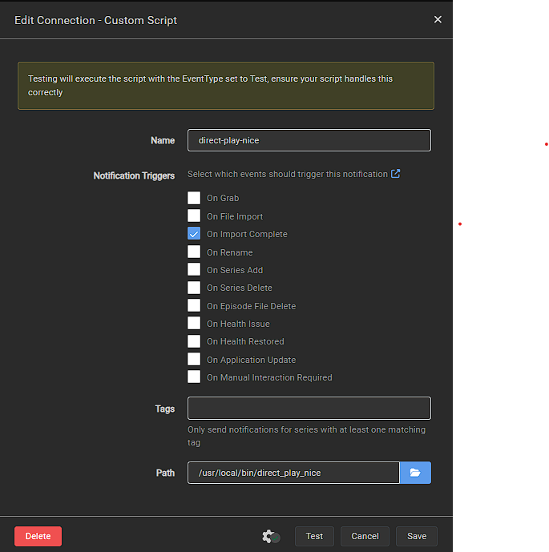

# direct-play-nice

A CLI utility to convert video files to Direct-Play-compatible (the single best
optimization for your home video streaming server) formats.

## Purpose

This tool was created to convert video files to formats that satisfy Direct Play
requirements for all video files used by your video streaming server and their
streaming devices (eg.
[Chromcast](https://developers.google.com/cast/docs/media)). It is intended to
be added to a video-downloading service (ie. with
[Sonarr](https://wiki.servarr.com/sonarr/custom-scripts) or
[Radarr](https://wiki.servarr.com/radarr/custom-scripts)) as an optimization
feature and seamless to the end user (ie. Direct Play selected by default).

## Features

- Converts any video file supported by [FFmpeg](https://www.ffmpeg.org/)
- Satisfies Direct Play requirements for [Plex](https://www.plex.tv/),
  [Jellyfin](https://jellyfin.org/), etc.
- Can be used standalone or as a Custom Script Connection with
  [Sonarr](https://wiki.servarr.com/sonarr/custom-scripts),
  [Radarr](https://wiki.servarr.com/radarr/custom-scripts), etc.
- Allows for achieving
  [Direct Play](https://support.plex.tv/articles/200250387-streaming-media-direct-play-and-direct-stream/)
  with all videos in a way seamless to the end user.
- Offers intuitive quality presets (match-source, 360p through 2160p + audio
  caps) so you can keep output sizes in check for fast starts on Plex and other
  direct-play servers.
- Targets every supported streaming device by default, or narrow the profile
  with `--streaming-devices`.

### Supported Streaming Devices

| Device Name                    | Release Year | Video Codecs                                       | Audio Codecs                                                                                  | Resolution Support |
| ------------------------------ | ------------ | -------------------------------------------------- | --------------------------------------------------------------------------------------------- | ------------------ |
| Chromecast                     | 2013         | H.264, VP8                                         | HE-AAC, LC-AAC, MP3, Vorbis, WAV (LPCM)                                                       | Up to 1080p        |
| Chromecast 2                   | 2015         | H.264, VP8                                         | HE-AAC, LC-AAC, MP3, Vorbis, WAV (LPCM)                                                       | Up to 1080p        |
| Chromecast Audio               | 2015         | N/A                                                | HE-AAC, LC-AAC, MP3, Vorbis, WAV (LPCM), FLAC                                                 | N/A                |
| Chromecast Ultra               | 2016         | H.264, VP8, VP9, HEVC                              | HE-AAC, LC-AAC, MP3, Vorbis, WAV (LPCM), FLAC                                                 | Up to 4K           |
| Chromecast 3                   | 2018         | H.264, VP8, VP9                                    | HE-AAC, LC-AAC, MP3, Vorbis, WAV (LPCM)                                                       | Up to 1080p        |
| Chromecast with Google TV      | 2020         | H.264, VP8, VP9, HEVC, Dolby Vision, HDR10, HDR10+ | HE-AAC, LC-AAC, MP3, Vorbis, WAV (LPCM), FLAC, Dolby Digital, Dolby Digital Plus, Dolby Atmos | Up to 4K HDR       |
| Chromecast with Google TV (HD) | 2022         | H.264, VP8, VP9, HEVC, HDR10, HDR10+               | HE-AAC, LC-AAC, MP3, Vorbis, WAV (LPCM), FLAC, Dolby Digital, Dolby Digital Plus, Dolby Atmos | Up to 1080p HDR    |

Each device above exposes a model identifier (e.g. `chromecast_ultra`). The CLI
assumes every device by default; supply
`--streaming-devices chromecast_ultra,chromecast_1st_gen` or
`--streaming-devices all` to override.

## Usage

This program can be run standlone directly on the CLI or as a Custom Script
Connection with [Sonarr](https://wiki.servarr.com/sonarr/custom-scripts) or
[Radarr](https://wiki.servarr.com/radarr/custom-scripts).

### CLI

```bash
Usage: direct_play_nice.exe [OPTIONS] <INPUT_FILE> <OUTPUT_FILE>

Arguments:
  <INPUT_FILE>   Video file to convert
  <OUTPUT_FILE>  Our output direct-play-compatible video file

Options:
  -s, --streaming-devices <STREAMING_DEVICES>
          Comma-separated device models or 'all'. When omitted or set to 'all',
          assumes all known devices.
  -c, --config-file <CONFIG_FILE>
          Path to the configuration file
      --video-quality <VIDEO_QUALITY>
          Target video quality profile (defaults to match the source)
          [default: match-source] [possible values: match-source, 360p, 480p,
          720p, 1080p, 1440p, 2160p]
      --audio-quality <AUDIO_QUALITY>
          Target audio quality profile (defaults to match the source)
          [default: match-source] [possible values: match-source, 320k, 256k,
          224k, 192k, 160k, 128k, 96k]
      --max-video-bitrate <MAX_VIDEO_BITRATE>
          Maximum video bitrate (e.g. 8M, 4800k, 5.5mbps)
      --max-audio-bitrate <MAX_AUDIO_BITRATE>
          Maximum audio bitrate (e.g. 320k, 0.2M)
      --unsupported-video-policy <POLICY>
          How to handle unsupported/extra video streams: convert|ignore|fail
          (default: ignore)
      --primary-video-stream-index <INDEX>
          Override auto selection of primary video stream (0-based)
      --primary-video-criteria <CRITERIA>
          Auto-pick criteria for primary video: resolution|bitrate|fps
          (default: resolution)
      --probe-streams
          Print detailed info for all streams in the input and exit
      --streams-filter <FILTER>
          Filter streams in probe: all|video|audio|subtitle (default: all)
      --output <FORMAT>
          Output format for probe results: text|json (default: text)
      --hw-accel <HW_ACCEL>
          Hardware acceleration: auto|none|nvenc|vaapi|qsv|videotoolbox|amf
          (default: auto)
      --probe-hw
          Print available HW devices/encoders and exit
      --probe-codecs
          Print all FFmpeg encoders/decoders and exit
      --only-video
          Probe filter: only show video codecs
      --only-hw
          Probe filter: only show hardware-capable codecs
      --probe-json
          Output probe results as JSON
  -h, --help
          Print help
  -V, --version
          Print version
```

Notes:

- In probe modes (`--probe-hw`, `--probe-codecs`, `--probe-streams`), the
  positional `<INPUT_FILE> <OUTPUT_FILE>` are not required (except
  `--probe-streams`, which requires `<INPUT_FILE>`).
- `-s all` has the same effect as omitting `-s`: the tool computes a
  direct-play profile compatible across all known devices.
- Combine `--servarr-output-extension` and `--servarr-output-suffix` to control
  how Sonarr/Radarr replacements are named. When run from Sonarr, the CLI
  defaults to creating `Episode.fixed.<ext>` (with the extension derived from
  the conversion output).
- Use `--delete-source` if you want the original input removed after a
  successful conversion (ignored during Sonarr/Radarr runs because the tool
  already swaps the file in place).
- The binary self-throttles: no more than two conversions run at once across all
  processes. Additional invocations wait until a slot is free.
- Tune concurrency via environment variables: set `DIRECT_PLAY_NICE_MAX_JOBS`
  for a global cap, or `DIRECT_PLAY_NICE_JOBS_PER_GPU` to control how many
  simultaneous encodes run on each detected GPU (default: two per NVIDIA/AMD
  device; NVIDIA is detected via `nvidia-smi`, AMD via `rocm-smi` on Linux or
  PowerShell on Windows). Machines without supported detection fall back to a
  single shared queue; set
  `DIRECT_PLAY_NICE_MAX_JOBS` manually if you want more parallelism on AMD or
  CPU-only hosts.

#### Device model strings for `-s`

- `chromecast_1st_gen`
- `chromecast_2nd_gen`
- `chromecast_ultra`

You can pass multiple, e.g. `-s chromecast_1st_gen,chromecast_2nd_gen`, or just
use `-s all`.

### Examples

Convert for all devices (same as omitting `-s`):

```bash
direct_play_nice -s all input.mkv out.mp4
```

Convert for specific devices (intersection of capabilities):

```bash
direct_play_nice -s chromecast_1st_gen,chromecast_2nd_gen input.mkv out.mp4
```

Probe hardware and codec availability (JSON):

```bash
direct_play_nice --probe-hw --probe-codecs --only-video --only-hw --probe-json
```

Probe input streams (text and JSON):

```bash
direct_play_nice --probe-streams input.mkv
direct_play_nice --probe-streams --output json input.mkv
```

### Sonarr / Radarr

When running via Sonarr, Radarr, etc you can use this program to convert each
downloaded video file to a Direct-Play-compatible format by adding it as a
Custom Script Connection (`Settings >> Connect >> Custom Script`).

The binary now auto-detects Sonarr/Radarr custom-script invocations:

- `sonarr_eventtype=Download` or `radarr_eventtype=Download` triggers an
  in-place transcode of the file referenced by the corresponding
  `$sonarr_episodefile_path` / `$radarr_moviefile_path` environment variable.
- All other event types (e.g. `Test`, `Grab`, `Rename`, etc.) exit cleanly
  without requiring any CLI arguments.
- By default the script promotes the converted output to an `.mp4` beside the
  original file (which is removed once the conversion completes). Override this
  by passing `--servarr-output-extension match-input` to keep the original
  container or any custom extension (e.g. `--servarr-output-extension mkv`).

Example Sonarr command:

```bash
/path/to/direct_play_nice --video-quality match-source --audio-quality match-source
```

Example Radarr command keeping the source container:

```bash
/path/to/direct_play_nice --servarr-output-extension match-input
```

Example Sonarr command that keeps all defaults (resulting in
`Episode.fixed.mp4` after conversion):

```bash
/path/to/direct_play_nice
```

> Tip: Sonarr/Radarr will see the new filename on their next library scan. If
> you convert to `.mp4`, Plex/Jellyfin can immediately direct play the result.



### Quality Controls

By default the CLI preserves source quality for both video and audio. To shrink
files ahead of Plex / Jellyfin direct play, mix and match:

- `--video-quality match-source|360p|480p|720p|1080p|1440p|2160p` applies
  intuitive resolution caps and matching H.264 bitrate ceilings. For example,
  `--video-quality 720p` clamps to 1280×720 and ~5 Mbps, while
  `--video-quality 2160p` scales to 3840×2160 at ~35 Mbps.
- `--audio-quality match-source|320k|256k|224k|192k|160k|128k|96k` sets AAC
  bitrate ceilings to well-known streaming tiers (e.g. `--audio-quality 192k`
  for a "standard" profile).
- Familiar aliases such as `--video-quality 4k`, `--video-quality full-hd`, or
  `--audio-quality high` map onto the presets above.

Need something custom? Use `--max-video-bitrate` and/or `--max-audio-bitrate` to
override the presets with any value such as `4800k`, `6M`, or `12.5mbps`.

## Building

This project relies on [FFmpeg](https://www.ffmpeg.org/) and
[rsmpeg](https://github.com/larksuite/rsmpeg) and builds on Mac, Linux and
Windows:

```bash
cargo install cargo-vcpkg
cargo vcpkg build
cargo build
```

After running `cargo vcpkg build` once, you can either point to that local vcpkg
with `VCPKG_ROOT` or rely on your global vcpkg. This repo does not force a vcpkg
path in `.cargo/config.toml` so your global `VCPKG_ROOT` (from shell/CI) is
respected.

## Tests

```bash
# If you use a global vcpkg, ensure VCPKG_ROOT is set in your shell/CI
# export VCPKG_ROOT=/path/to/vcpkg
cargo test
```

End‑to‑end conversion tests that synthesize media require the `ffmpeg` CLI and
are marked `#[ignore]`. To run them explicitly:

````bash
VCPKG_ROOT=/path/to/vcpkg cargo test -- --ignored

### Optional: direnv

If you use `direnv`, you can let local builds auto‑discover a project vcpkg checkout:

```sh
# .envrc (example)
export RUST_LOG=WARN
if [ -z "${VCPKG_ROOT}" ] && [ -f "$(pwd)/target/vcpkg/.vcpkg-root" ]; then
  export VCPKG_ROOT="$(pwd)/target/vcpkg"
fi
````

Then run `direnv allow` once in the repo.

## Contributions / Support

If you run into any issues while using this software or want to add a feature or
bug fix feel free to raise an issue.
