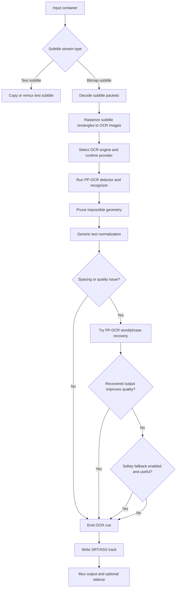

# Subtitle OCR

Bitmap subtitle formats (PGS/VobSub/DVD) are not directly compatible with MP4
Direct Play in many client stacks. `direct_play_nice` can OCR bitmap subtitles
into text tracks using AI OCR backends (PP-OCR/Tesseract). This path is meant
for bitmap subtitle streams; text subtitles are muxed directly when compatible.

For official GPU architecture/provider references and compatibility links, see
[Hardware Acceleration](./hardware-acceleration.md).

## Defaults

- `--sub-mode auto`
- `--ocr-engine auto`
- `--ocr-format srt`
- `--ocr-preprocess none`

## Common overrides

- `--sub-mode skip` disable subtitle processing
- `--sub-mode force` force subtitle processing
- `--ocr-engine pp-ocr-v4` force PP-OCR v4 pipeline
- `--ocr-engine pp-ocr-v3` fallback for older GPU/runtime combinations
- `--ocr-format ass` request ASS (may be downgraded in MP4)
- `--ocr-preprocess open-cv-basic` or `open-cv-subtitle` enable optional
  CPU OpenCV bitmap cleanup before OCR
- `--ocr-preprocess open-cv5-cuda-basic` or `open-cv5-cuda-subtitle` enable
  adaptive OpenCV 5 CUDA bitmap cleanup for OCR rescue candidates
- `--ocr-write-srt-sidecar` write `.srt` sidecars in addition to embedded output

## OCR flow

Bitmap subtitle OCR runs as a side pass after the main media streams are planned.
The default path is PP-OCR first; Tesseract is only used as a quality fallback
when enabled and when the PP-OCR result fails generic quality checks.



Quality checks include low spacing density, long glued tokens, mixed-case glue,
low-information garbage fragments, and impossible bounding boxes. The goal is to
prefer the best AI OCR result first, then use the fallback only for residual
cue-level failures.

## Optional OpenCV preprocessing

`--ocr-preprocess` defaults to `none` and preserves existing OCR behavior. Builds
compiled with `--features opencv-preprocess` can select CPU-side OpenCV cleanup
of rasterized subtitle bitmaps before PP-OCR/Tesseract sees the frame:

- `open-cv-basic`: median blur plus Otsu thresholding.
- `open-cv-subtitle`: light Gaussian blur, adaptive thresholding, and a small
  morphological close tuned for subtitle glyph cleanup.

The CPU OpenCV path preprocesses the PGM frame bytes only; PP-OCR inference still
uses the configured ONNX Runtime execution provider, so CUDA/DirectML/CoreML GPU
acceleration is unchanged. Selecting a CPU OpenCV mode in a build without the
feature fails fast with a clear runtime error.

## GPU behavior

The OCR runtime attempts provider fallback when available (for example CUDA,
DirectML, CoreML, then CPU). You can force behavior with:

- `DPN_OCR_REQUIRE_GPU=1`
- `DPN_OCR_FORCE_CPU=1`

ONNX engines:

- `--ocr-engine pp-ocr-v4` for modern GPU/runtime stacks
- `--ocr-engine pp-ocr-v3` for legacy/older GPU compatibility cases

Linux runtime notes:

- Ensure CUDA/cuDNN and ONNX Runtime are version-compatible.
- `ORT_DYLIB_PATH=/path/to/libonnxruntime.so` can be used if ONNX Runtime is
  not discoverable on default library paths.
- For older NVIDIA stacks, `--ocr-engine pp-ocr-v3` can be more stable than
  `pp-ocr-v4`.
- Use `scripts/ocr-tools/check_gpu_env.sh` to inspect runtime/library setup.
- Containerized workloads may need NVIDIA Container Toolkit and exposed runtime
  libraries.

## Model location

Models are downloaded to a default model directory unless `DPN_OCR_MODEL_DIR`
is set.

Default model filenames:

- v4: `ch_PP-OCRv4_det_infer.onnx`, `ch_ppocr_mobile_v2.0_cls_infer.onnx`,
  `en_PP-OCRv4_rec_infer.onnx`
- v3: `ch_PP-OCRv3_det_infer.onnx`, `ch_ppocr_mobile_v2.0_cls_train.onnx`,
  `en_PP-OCRv3_rec_infer.onnx`

Optional profile rec models are also auto-provisioned (downloaded on first use
if missing in the model directory):

- `latin_PP-OCRv3_rec_mobile.onnx`
- `japan_PP-OCRv4_rec_mobile.onnx`
- `korean_PP-OCRv4_rec_mobile.onnx`
- `chinese_cht_PP-OCRv3_rec_mobile.onnx`

Override paths for these optional profiles with:

- `DPN_OCR_REC_LATIN_MODEL`
- `DPN_OCR_REC_MULTILINGUAL_MODEL`
- `DPN_OCR_REC_JAPANESE_MODEL`
- `DPN_OCR_REC_KOREAN_MODEL`
- `DPN_OCR_REC_CJK_MODEL`

`DPN_OCR_REC_MULTILINGUAL_MODEL` is local-first: if unset, OCR auto-detects a
compatible multilingual recognizer already present in the model directory
(for example `multilingual_PP-OCRv4_rec_infer.onnx`) and uses it when script
routing targets multilingual coverage. Unlike latin/japanese/korean/cjk
profiles, this profile is not downloaded automatically.

Override recognition profile routing (language -> profile) with:

- `DPN_OCR_REC_PROFILE_OVERRIDES`
  Example: `spa=latin,rus=multilingual,sr-Latn=latin`
  Script tags are also recognized automatically (for example `zh-Hant`,
  `sr-Cyrl`, `sr-Latn`).
- `DPN_OCR_LANGUAGE_SCRIPT_HINTS`
  Example: `rus=Cyrl,ara=Arab,srp=Cyrl`
- `DPN_OCR_ROUTING_MANIFEST`
  Path to custom TOML routing manifest
  (default: `config/ocr-routing.toml` in the repo source tree).

## Optional OpenCV 5 CUDA preprocessing

For NVIDIA hosts with a CUDA-enabled OpenCV 5 install, build the binary with
`--features opencv-cuda-preprocess` and install the runtime shim:

```bash
scripts/opencv-tools/build_opencv5_cuda.sh \
  --prefix /opt/direct-play-nice/opencv5-cuda \
  --cuda-arch 5.2
export LD_LIBRARY_PATH=/opt/direct-play-nice/opencv5-cuda/lib:${LD_LIBRARY_PATH:-}
export DPN_OPENCV5_CUDA_PREPROCESS_LIB=/opt/direct-play-nice/opencv5-cuda/lib/libdpn_opencv5_cuda_preprocess.so
```

Then select one of the CUDA profiles:

- `open-cv5-cuda-basic`
- `open-cv5-cuda-subtitle`

These modes keep the normal PP-OCR flow as the fast path. Each rendered subtitle
bitmap is OCR'd first without CUDA preprocessing; after existing word-segmentation
recovery, frames that still show spacing/quality issues are uploaded to
`cv::cuda::GpuMat`, filtered/thresholded, downloaded, and OCR'd again. The CUDA
result is accepted only when it fixes spacing without meaningful quality loss or
when it produces a clear quality gain. This avoids paying GPU upload/download
cost for frames whose baseline OCR is already good. The CUDA profiles
intentionally use fixed thresholds in the shim, so they are GPU-oriented
approximations of the CPU adaptive/Otsu profiles rather than byte-identical
implementations. PP-OCR inference remains on ONNX Runtime providers such as CUDA;
the OpenCV 5 CUDA path accelerates preprocessing rather than replacing the OCR
inference provider.

## Config-file example

```toml
sub_mode = "auto"           # auto | force | skip
ocr_default_language = "eng"
ocr_engine = "auto"         # auto | tesseract | pp-ocr-v3 | pp-ocr-v4 | external
ocr_format = "srt"          # srt | ass
ocr_preprocess = "none"       # none | open-cv-basic | open-cv-subtitle | open-cv5-cuda-basic | open-cv5-cuda-subtitle
ocr_write_srt_sidecar = false
ocr_external_command = "python3 /opt/ocr/run.py"
```
